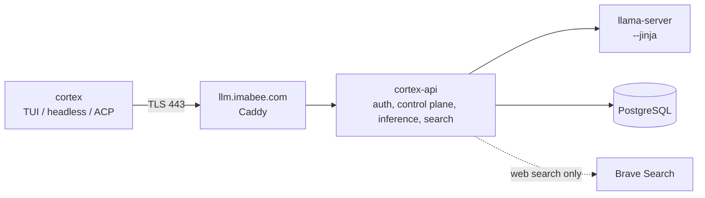
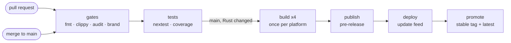

<div align="center">


# Cortex

**A terminal coding agent that runs on your own model.**
Full-screen TUI, headless mode for scripts and CI, and ACP for editors, all talking to a
single self-hosted gateway in front of [llama.cpp](https://github.com/ggml-org/llama.cpp).

[](https://github.com/imabee101/cortex/releases/latest)
[](https://github.com/imabee101/cortex/actions/workflows/ci.yml)
[](LICENSE)


[Install](#install) · [How it fits together](#how-it-fits-together) · [Releases](#releases) · [Build](#build-from-source) · [Docs](#documentation) · [License](#license)


</div>

## Install

```sh
curl -fsSL https://llm.imabee.com/cli/install.sh | bash
```

One command on every platform: macOS, Linux, WSL, and Windows in Git Bash (it installs `cortex.exe`). Builds: Linux x86_64 and aarch64, macOS Apple silicon, Windows x86_64. `cortex update` upgrades in place from the same host. The first launch opens your browser to sign in.

## How it fits together



- **One host.** The client contacts `llm.imabee.com` and nothing else. No telemetry leaves it.
- **`cortex-api`** (Rust, [`cortex-api/`](cortex-api)) is the server the client was built for: OIDC login,
  models and settings, `chat_completions` / `responses` / `messages` streaming, memory embeddings,
  server-side web search, session sync, and the update feed.
- **The client is a rename and nothing more.** All translation lives in the server, so the harness
  runs unmodified.

## Releases

One workflow, [`ci.yml`](.github/workflows/ci.yml), driven by the event. Cheap checks gate the expensive ones, and each release binary is compiled once.



- Every build is `<version>-build.<run number>` in its tag, release and artifact names. The binary reports the plain `<version>` and its commit (`cortex 1.0.48 (0fcd6607943e)`), because the updater's stable channel refuses pre-release versions. The CI picks the version from tags (patch by default, a `minor` or `major` PR label raises it); no file is edited.
- Windows is cross-built on Linux, macOS and ARM Linux are native. Changes that touch no Rust path build and publish nothing, so build numbers can skip.
- Every merge that changes Rust ships with no manual step: the same verified bytes go to the feed `cortex update` reads, the previous client must update itself to them or the host rolls back, and only then does CI tag `vX.Y.Z` and mark the release latest.
- Assets carry `SHA256SUMS` and a build-provenance attestation: `gh attestation verify <file> --repo imabee101/cortex`.

Operations (deploy host, limits, backups, rollback) are in [`RUNBOOK.md`](RUNBOOK.md). How harness and model changes are measured (Terminal-Bench 2.0) is in [`EVALUATION.md`](EVALUATION.md). The per-model levers for tuning a model are in [`TUNING.md`](TUNING.md).

## Build from source

Rust is pinned by [`rust-toolchain.toml`](rust-toolchain.toml). Proto codegen needs `protoc`
(`$PROTOC`, a `protoc` on `PATH`, or [DotSlash](https://dotslash-cli.com) for [`bin/protoc`](bin/protoc)).

```sh
cargo run -p cortex-pager-bin                 # build and launch the TUI
cargo build -p cortex-pager-bin --release     # target/release/cortex-pager (shipped as `cortex`)
cargo test -p cortex-api --locked             # server contract tests (needs PostgreSQL on 127.0.0.1)
```

Target specific crates; full-workspace builds are slow. The root `Cargo.toml` is generated: edit per-crate manifests.

## Documentation

The user guide ships with the TUI crate:
[`crates/codegen/cortex-pager/docs/user-guide/`](crates/codegen/cortex-pager/docs/user-guide/)
(shortcuts, slash commands, configuration, MCP, skills, hooks, headless mode, sandboxing).

External contributions are not accepted ([`CONTRIBUTING.md`](CONTRIBUTING.md)); security reports go through [`SECURITY.md`](SECURITY.md).

## License

Apache License 2.0, see [`LICENSE`](LICENSE). Third-party and vendored code keeps its own licenses:
[`THIRD-PARTY-NOTICES`](THIRD-PARTY-NOTICES), [`third_party/NOTICE`](third_party/NOTICE), and the crate-local
[`notices`](crates/codegen/cortex-tools/THIRD_PARTY_NOTICES.md) for the ported tool code.
`SOURCE_REV` records the upstream commit this tree derives from.
